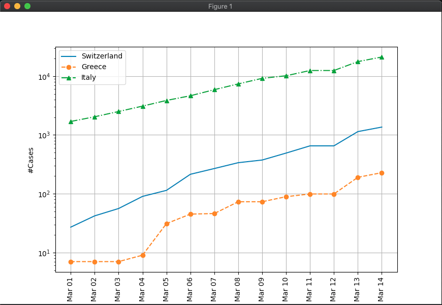
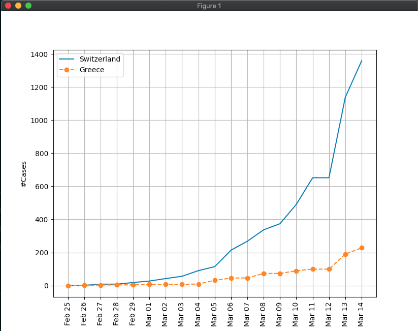
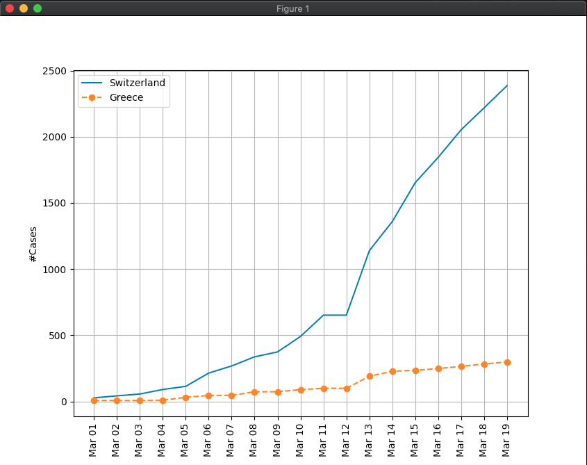

# covid19

Simple Python app for querying, visualizing and predicting COVID19 incidents.
Data can be found at: https://github.com/CSSEGISandData/COVID-19

## Examples

Visualize in log scale the number of incidents for the given countries between 2020-03-01 and 2020-03-10
```bash
> python covid19.py --file $CSV --countries Switzerland Greece Italy --start_date 2020-03-01 --end_date 2020-03-14 --log
```


Visualize in log scale the number of incidents between 2020-03-01 and today
```bash
> python covid19.py --file $CSV --countries Switzerland Greece --start_date 25-02-2020
```



Predict the number of incidents for the next 10 days
```bash
> python covid19.py --file $CSV --countries Switzerland Greece --days 5
```




